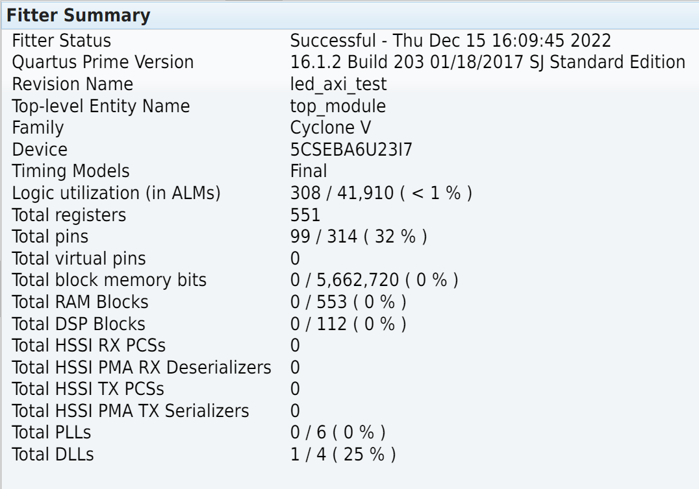

# Reporte Trabajo Final - Microarquitecturas y Softcores

_Puerto Montt, 13 de septiembre de 2022, Nicolás Hasbún A._

Trabajos práctico final realizado en el contexto de la Carrera de Especialización de Sistemas Embebidos de la Universidad de Buenos Aires para el curso de **microarquitecturas y softcores**.

[TOC]

# Resumen

Se realiza una revisión a un sistema SoC FPGA en donde se realizan transacciones entre el procesador (PS) y la lógica programable (PL). Los lineamientos son los mismos vistos en el curso para la placa Arty Z7 de Digilent pero aplicados a la placa DE10-Nano de Terasic. Esto considera:

- Cambio de entorno de desarrollo desde Xilinx a Altera
- Uso de Verilog y simulaciones
- Interacciones PS-PL via AXI Bus
- Uso de IP Cores originales y propios
- Desarrollo de software para PS
- Proyecto de Ejemplo base con LEDs y Switchs

## Revisión Kit Desarrollo

Se utilizó el kit de desarrollo FPGA **DE10-Nano** del fabricante Terasic. Una imagen de la placa se observa a continuación:


Diagrama de bloques para recursos disponibles en el kit de desarrollo:


Conexiones disponibles en el bus AXI:


## Propuesta

Implementar un proyecto básico que considere interacciones entre PS/PL utilizando el bus AXI y que haga uso del entorno de desarrollo entregado por Altera. En particular:

- Controlar LEDs conectados en la FPGA desde el HPS
- Lectura de switches en la FPGA desde el HPS
- Considerar mecanismos de interconexiones y creación de IP Cores propios

Recursos relevantes:


# Módulo Led Core

Módulo en verilog de funcionalidad sencilla que permite tener a partir de una señal de entrada una representación binaria en los 8 LEDs disponibles en la placa. La funcionalidad extra que se agrega es la capacidad de limitar el número máximo representado por los LEDs.


Ejemplo:

Si limitamos el valor a **8'b0000_1111**, sólo los primeros 4 LEDs estarán disponibles y cualquier valor mayor a 15 apagará todos los leds.

## Implementación

Vista de bloque y código principal:


## Simulaciones

Vista de simulaciones en base a Icarus Verilog y GTKWave:


# GUI para Integración de Componentes

Para Altera dentro de su suite de programación Quartus Prime existe una herramienta llamada Qsys que permite integrar varios IP Cores y empaquetarlos en un módulo que luego puede ser instanciado en Verilog/VHDL.

## Creación de Componente

 En Qsys es necesario ir a **Files -> New Component**.


Acá se pueden declarar los archivos que definen nuestro componente. Puede utilizarse código en Verilog/VHDL y código previamente sintetizado por las herramientas con extensión **.qxp**.


Se configuran las señales de entrada y salida según corresponda.


Esto generará un archivo del tipo **name_hw.tcl**. Acá si queremos empaquetar nuestro IP core y entregarlo como un sólo elemento hay que fijarse en las rutas, corregirlas y listo.


## Integración con HPS

Se considera una implementación mínima donde agrega:

- IP Core para comunicación con el HPS
- IO para LEDs (mapeado a memoria)
- IO para Switch (mapeado a memoria)
- Integración con nuestro **Led Core**

El sistema queda del siguiente modo:


En particular para el IP Core **Cyclone V Hard Processor System** se trabaja con interfaces mínimas, en específico basta con configurar una salida para el bus axi light:


## Integración con Módulo Top

Para instanciar nuestro nuevo módulo **axi_test** al resto de la jerarquía de la FPGA basta con instanciar el módulo según se indica en el menú de Qsys **Generate => Show Instantiation Template**.

Esto quedaría del siguiente modo:

```verilog
    axi_test u0 (
        .clk_clk                           (FPGA_CLK1_50),
        .led_core_0_led_out_dummy          (LED),
        .sw_pio_external_connection_export (SWITCH),

        .memory_mem_a                 (memory_mem_a),
        .memory_mem_ba                (memory_mem_ba),
        .memory_mem_ck                (memory_mem_ck),
        .memory_mem_ck_n              (memory_mem_ck_n),
        .memory_mem_cke               (memory_mem_cke),
        .memory_mem_cs_n              (memory_mem_cs_n),
        .memory_mem_ras_n             (memory_mem_ras_n),
        .memory_mem_cas_n             (memory_mem_cas_n),
        .memory_mem_we_n              (memory_mem_we_n),
        .memory_mem_reset_n           (memory_mem_reset_n),
        .memory_mem_dq                (memory_mem_dq),
        .memory_mem_dqs               (memory_mem_dqs),
        .memory_mem_dqs_n             (memory_mem_dqs_n),
        .memory_mem_odt               (memory_mem_odt),
        .memory_mem_dm                (memory_mem_dm),
        .memory_oct_rzqin             (memory_oct_rzqin),

        .hps_io_hps_io_emac1_inst_TX_CLK (hps_io_hps_io_emac1_inst_TX_CLK),
        .hps_io_hps_io_emac1_inst_TXD0   (hps_io_hps_io_emac1_inst_TXD0),
        .hps_io_hps_io_emac1_inst_TXD1   (hps_io_hps_io_emac1_inst_TXD1),
        .hps_io_hps_io_emac1_inst_TXD2   (hps_io_hps_io_emac1_inst_TXD2),
        .hps_io_hps_io_emac1_inst_TXD3   (hps_io_hps_io_emac1_inst_TXD3),
        .hps_io_hps_io_emac1_inst_RXD0   (hps_io_hps_io_emac1_inst_RXD0),
        .hps_io_hps_io_emac1_inst_MDIO   (hps_io_hps_io_emac1_inst_MDIO),
        .hps_io_hps_io_emac1_inst_MDC    (hps_io_hps_io_emac1_inst_MDC),
        .hps_io_hps_io_emac1_inst_RX_CTL (hps_io_hps_io_emac1_inst_RX_CTL),
        .hps_io_hps_io_emac1_inst_TX_CTL (hps_io_hps_io_emac1_inst_TX_CTL),
        .hps_io_hps_io_emac1_inst_RX_CLK (hps_io_hps_io_emac1_inst_RX_CLK),
        .hps_io_hps_io_emac1_inst_RXD1   (hps_io_hps_io_emac1_inst_RXD1),
        .hps_io_hps_io_emac1_inst_RXD2   (hps_io_hps_io_emac1_inst_RXD2),
        .hps_io_hps_io_emac1_inst_RXD3   (hps_io_hps_io_emac1_inst_RXD3)
    );
```

Acá las conexiones **memory_xxx** y **hps_xxx** no son relevantes para nuestro proyecto pero son necesariar para que los proyectos con integración PS/PL compilen correctamente.

En particular al integrar **axi_test** es importante correr en Quartus Prime **Tools => Tcl Scripts => hps_sdram_p0_pin_assignments.tcl** pues la FPGA necesita configurar los pines asociados a memoria con el voltaje correcto aún cuando no los utilicemos.

# Desarrollo de Software

Existe una imagen para cargar en una memoria microSD que entrega el fabricante donde el sistema arranca en ~10 segundos con Linux (ver http://de10-nano.terasic.com/).

Podemos entrar por conexión serial disponible en el kit o a través de la interfaz de ethernet. Para asignar ip estática se pueden seguir [éstas instrucciones](https://www.terasic.com.tw/wiki/How_to_set_static_IP_for_DE10-Standard_console_image).

Vista de conexión serial (baudrate por defecto en 115200):


## Librerías para HPS

Para la comunicación con los recursos del procesador incluído la comunicación con el bus AXI, Altera entrega dos librerías principales:

- SoC Abstraction Layer (SoCAL)
- HW Manager


Más información puede obtenerse de la página de RocketBoards y de la documentación local (Ver sección de recursos). 

Principalmente ocuparemos:

- **alt_write_word:** API para escribir a memoria en el bus AXI
- **alt_read_byte:** API para leer desde la memoria en el bus AXI
- **ALT_LWFPGASLVS_OFST:** Macro que indica *offset* desde donde está disponible en memoria los recursos del bus AXI Light

## Código de Ejemplo

Este es un código de ejemplo para escribir valores en los registros que lee nuestro **Led Core**. El código completo se entrega con el proyecto.

```c
#include <sys/mman.h> // mmap
#include <pthread.h> // pthreads
#include "socal/socal.h"
#include "socal/hps.h" // para BASEADD


#define LEDADD 	  0x0000
#define SWADD     0x1000
#define BASEADD	  ALT_LWFPGASLVS_OFST

int main()
{
    size_t largobytes = 4;

    int fd; // file descriptor
    fd = open("/dev/mem", (O_RDWR|O_SYNC));

    virtualbase = mmap(NULL, largobytes,
     (PROT_READ|PROT_WRITE), MAP_SHARED, fd, BASEADD + LEDADD);
    // MAP_SHARED comparte la memoria con otras apicaciones
    // PROT READ y PROT WRITE, para lectura y escritura

    virtualbase_sw = mmap(NULL, 1, (PROT_READ | PROT_WRITE), MAP_SHARED, fd, BASEADD + SWADD);
    pthread_create(&thread, NULL, leerSwitchs, NULL);

    uint32_t count = 0;

    while(1) {
        usleep(100*1000); // sleep forever

        alt_write_word(virtualbase, count++);
    }

    return 0;
}
```

## Compilación

Para efectuar la compilación cruzada desde máquinas **x64/AMD64** para ARM Cortex-A9 Altera entrega un ambiente de desarrollo llamado **SoC EDS Command Shell**.

El principal requisito es indicar correctamente el lugar donde están las librerías de HW Manager y SoCAL. Se agrega un ejemplo:

```makefile
TARGET = ledtest

#
ALT_DEVICE_FAMILY ?= soc_cv_av

HWLIBS_ROOT = $(SOCEDS_DEST_ROOT)/ip/altera/hps/altera_hps/hwlib

CFLAGS = -g -Wall -Werror -I$(HWLIBS_ROOT)/include -I$(HWLIBS_ROOT)/include/$(ALT_DEVICE_FAMILY) -D$(ALT_DEVICE_FAMILY)
LDFLAGS = -g -Wall -Werror -pthread -lpthread

CROSS_COMPILE = arm-linux-gnueabihf-
CC = $(CROSS_COMPILE)gcc
LD = $(CROSS_COMPILE)gcc
ARCH = arm

.PHONY: build
build: $(TARGET)

$(TARGET): main.o
	$(LD) $(LDFLAGS)   $^ -o $@

%.o : %.c
	$(CC) $(CFLAGS) -c $< -o $@
```

# Pruebas y Demo

Lectura de switches:


Control de Led Core con valor máximo 15:


# Recursos de FPGA

Reportes respecto al uso de recursos y restricciones temporales.




# Recursos y Links

- [Intel® SoC FPGA Bare-metal Developer Center](https://www.intel.com/content/www/us/en/support/programmable/support-resources/design-guidance/bare-metal-developer.html)
- [Embedded Software and Tools for Intel® SoC FPGA](https://www.intel.com/content/www/us/en/software/programmable/soc-eds/overview.html)
- [RocketBoards Hardware Library (HWLibs)](https://www.rocketboards.org/foswiki/Documentation/HWLib)
- [Intel® SoC FPGA Embedded Development Suite (SoC EDS) User Guide](https://www.intel.com/content/www/us/en/docs/programmable/683187/20-1/introduction-to-the-soc-fpga-embedded.html)
- Documentación de librerías HWLibs y SoCal de forma local en **C:\intelFPGA\16.1\embedded\ip\altera\hps\altera_hps\doc\soc_cv_av**


